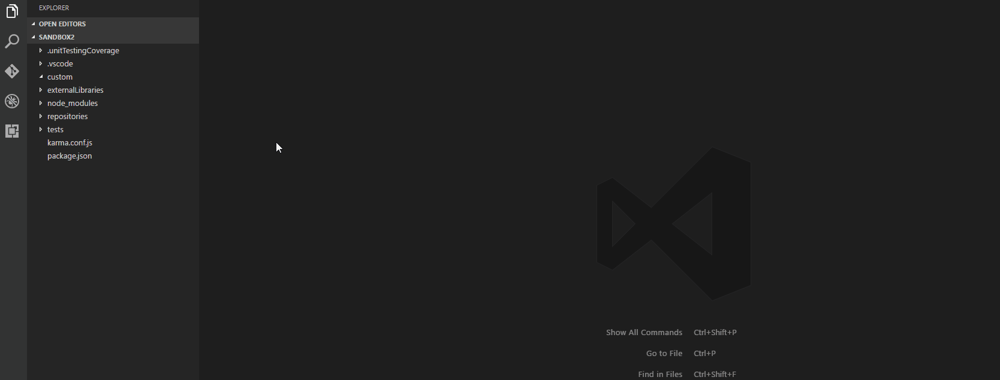
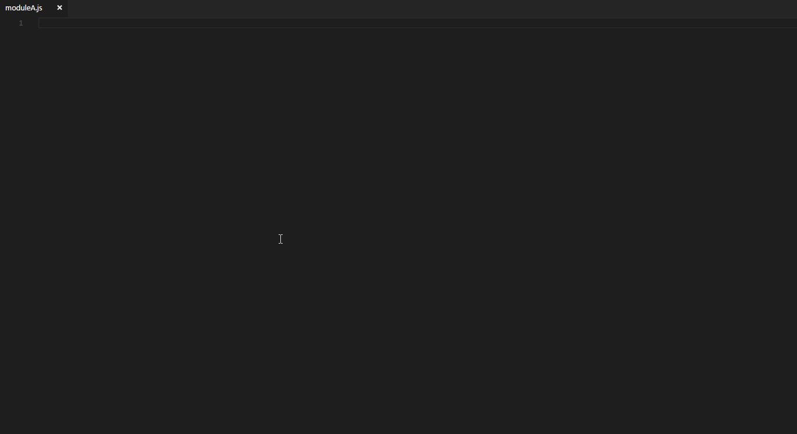

# netsuite-upload VS Code plugin

[](https://marketplace.visualstudio.com/items?itemName=tomastvrdy.netsuite-upload)

**netsuite-upload** is a Visual Studio Code extension that allows you to manage your SuiteScript files directly from the IDE & helps you with defining of new momdules & module dependecies

## Features
### 1. NetSuite File Cabinet Management
Right-click the file/folder in the navigation panel to see the options:

- `Pull file from NetSuite` - downloads file from NetSuite
- `Push file to NetSuite` - uploads file to NetSuite
- `Delete file in NetSuite` - deletes file in NetSuite
- `Compare file with NetSuite` - compares your local version with the NetSuite one
- `Pull folder from NetSuite` - Download the folder content from NetSuite

  

### 2. Snippets & commands

- `Snippets for module initialization` - type *defineRestlet...*, choose your module type and hit enter
- `Commands for adding new NetSuite/custom dependencies` - open command line (`Ctrl`-`Shift`-`P`) and type
	- *add netsuite dependency* for choosing of the NetSuite built-in module from the list
	- *add custom dependency* for defining od custom dependecies 

  

## Setup
##### NetSuite setup
- Upload `netSuiteRestlet/vscodeExtensionRestlet.js` file somewhere in the `SuiteScripts` folder in NetSuite
- Create and deploy RESTlet using the file. (RESTlet URL will be set in the `settings.json`)

##### VSCode project setup
- Open your local root **SuiteScripts** folder in VSCode
- If not yet created, create one or update the project `settings.json` inside the `.vscode` folder
- Copy the following code to `settings.json` and update with your settings

**settings.json**
```javascript
{
	// Authentication header
  	"netSuiteUpload.authentication": "NLAuth nlauth_account=<ACCOUNTID>, nlauth_email=<LOGIN>, nlauth_signature=<PASSWORD>, nlauth_role=<ROLE>",

	// Restlet URL
	"netSuiteUpload.restlet": "<RESTlet URL>",

	// Temporary folder (e.g. C:\\temp) - used for storing compared file
	"netSuiteUpload.tempFolder": "<TEMP FOLDER PATH>"

	// Base NetSuite folder path to upload script to (e.g. "SuiteScripts/Developer")
	"netSuiteUpload.rootDirectory": "<BASE FOLDER PATH>"
}
```

## Limitation
The plugin is using RESTlet for the communication with the NetSuite which is having some governance limitation. Current implementation does not deal with this problem, so there could be a problem to pull folders containing a lot of items from NetSuite.